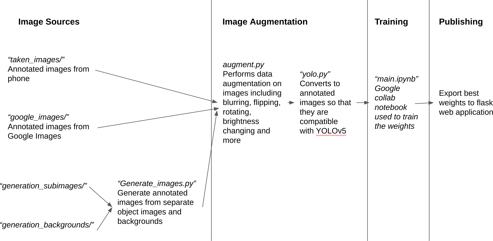

# trailmix_detection
A web page that counts the number of m and ms, peanuts, raisins, and almonds in the picture. Using annotated images from several sources, I trained a pre-trained model to segment images via the YOLOv5 library.

